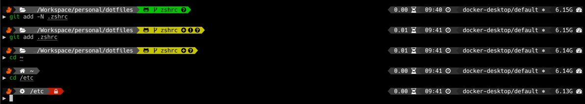

# dotfiles

## PowerLevel9k based shell customization (.zshrc)
### Screenshot
<details>
<summary>Prompt configuration (click to expand...)</summary>

<ul>
    <li>Left:</li>
    <ul>
        <li>Custom Segment</li>
        <li>Indicator if the user has superuser status</li>
        <li>Current working directory</li>
        <li>Lock icon if you do not have write permissons on current folder</li>
        <li>Information about git repository</li>
    </ul>
    <li>Right:</li>
    <ul>
        <li>Command execution time</li>
        <li>Time</li>
        <li>Current context of `kubectl` configuration</li>
        <li>Free RAM</li>
    </ul>
</ul>
</details>




### Setup:
- Follow guides such as [this one](https://medium.com/@alex285/get-powerlevel9k-the-most-cool-linux-shell-ever-1c38516b0caa) to learn how to set up ZSH, Oh My Zsh & PowerLevel9k
- Used Resources:
    - [PowerLevel9k](https://github.com/Powerlevel9k/powerlevel9k) is a prompt theme for ZSH 
    - [Oh My ZSH](https://github.com/ohmyzsh/ohmyzsh) is a framework for managing your zsh configuration...
    - [Nerd Fonts](https://github.com/ryanoasis/nerd-fonts)
    - [Character Map](https://bluejamesbond.github.io/CharacterMap/)

### Getting started
- ZSH configuration file is located under `~/.zshrc`
- See comments in .zshrc file itself that explain the different configurations
- Update path to your oh-my-zsh installation:
    ```bash
    export ZSH="/Users/<user>/.oh-my-zsh"
    ```
- Install [used plugins](#plugins-used)
- Setting aliases:
    - Aliases can be added to the `.zshrc` file
    - However, users are encouraged to define aliases within the `ZSH_CUSTOM` folder
        - `.zsh` files in the `ZSH_CUSTOM` folder will be automatically sourced
        - All of my aliases are located in `$ZSH_CUSTOM/alias.zsh`

### Plugins used
- [Kubernetes autocompletion](https://kubernetes.io/docs/tasks/tools/install-kubectl/#enabling-shell-autocompletion)
- [Git](https://github.com/ohmyzsh/ohmyzsh/tree/master/plugins/git)
- [Colorize](https://github.com/ohmyzsh/ohmyzsh/tree/master/plugins/colorize) (Syntax highlighting)
- [zsh-syntax-highlighting](https://github.com/zsh-users/zsh-syntax-highlighting) (Syntax highlighting)